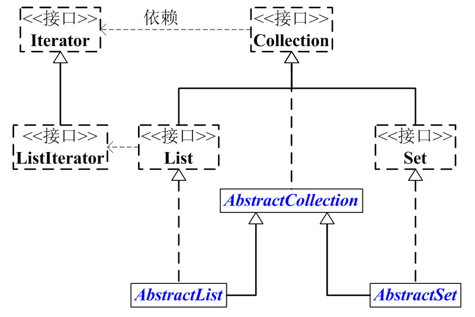

内容参考于[此文](https://www.cnblogs.com/skywang12345/p/3308513.html#a1)

### 概述

Collection时java集合工具包中的一个接口，位于java.util包中，是高度抽象出来的集合，包含了集合的基本操作和属性，继承了Iterable接口



Collection包含了List和Set两大分支

- List也是一个接口，继承自Collection接口，是一个有序的队列，每一元素都有它的索引，第一个元素的索引值为0；List接口的实现类有LinkedList，ArrayList，Vector，Stack。
- Set也是一个接口，是一个不允许有重复元素的集合，Set的实现类有HashSet和TreeSet；HashSet依赖于HashMap，它实际上是通过HashMap实现的；TreeSet依赖于TreeMap，它实际上是通过TreeMap实现的。

### Collection

Collection定义：`public interface Collection<E> extends Iterable<E>{}`

```java
//Collection接口中定义的方法

boolean add(Object o)	//该方法实现单元素的添加功能，先确定集合是否包含对象o，如果需要添加该对象则返回true。如果集合允许重复，add方法总是返回true。如果不允许重复，并已经有一个相等的元素在集合中，则add方法返回false
boolean remove(Object o)	//该方法实现单元素的删除，如果集合中有与o相匹配的对象，则删除对象o，并返回true；反之返回false。如果o是null，并且集合中也有一个元素为null，也返回true
boolean addAll(Collection c)	//将集合c中所有元素加给该集合
boolean removeAll(Collection c)	//从集合中删除集合c中的所有元素
void retainAll(Collection c)	//从集合中删除集合c不包含的元素
void clear()	//清空当前集合
int size()	//返回当前集合中元素的数量
boolean isEmpty()	//判断集合是否为空
boolean contains(Object o)	//查找集合中是否含有对象o
boolean containsAll(Collection c)	//查找集合中是否含有集合c中的所有元素
Iterator iterator()	//返回一个迭代器对象，用来访问集合中的各个元素
Object[] toArray()	//返回一个内含集合所有元素的Object类型数组
T[] toArray(T[] a)   //返回一个内含集合所有元素的特定类型数组，a,集合元素存储到的数组，如果数组a的空间不够，将返回一个新数组
int hashCode()  //Returns the hash code value for this collection
boolean equals()  //Compares the specified object with this collection for equality
```

Collection接口的所有子类(直接子类和间接子类)都必须实现2种构造函数：不带参数的构造函数 和 参数为Collection的构造函数。带参数的构造函数，可以用来转换Collection的类型

为了方便，抽象出了AbstractCollection抽象类，实现了Collection接口中的绝大部分函数，这样在Collection的实现类中，就可以通过继承AbstractCollection省去重复编码。AbstractList和AbstractSet都继承于AbstractCollection，具体的List实现类继承于AbstractList，而Set的实现类则继承于AbstractSet。
另外，Collection中有一个iterator()函数，它的作用是返回一个Iterator接口。通常，我们通过Iterator迭代器来遍历集合。ListIterator是List接口所特有的，在List接口中，通过ListIterator()返回一个ListIterator对象。

#### List

List定义：`public interface List<E> extends Collection<E> {}`

List是一个继承与Collection的接口，是有序的队列，每一个元素都有索引，元素可重复

**API**

```java
// Collection的API
abstract boolean add(E object)
abstract boolean addAll(Collection<? extends E> collection)
abstract void clear()
abstract boolean contains(Object object)
abstract boolean containsAll(Collection<?> collection)
abstract boolean equals(Object object)
abstract int hashCode()
abstract boolean isEmpty()
abstract Iterator<E> iterator()
abstract boolean  remove(Object object)
abstract boolean  removeAll(Collection<?> collection)
abstract boolean  retainAll(Collection<?> collection)
abstract int  size()
abstract <T> T[]   toArray(T[] array)
abstract Object[]  toArray()
    
// 相比与Collection，List新增的API：
abstract void     add(int location, E object) //在指定位置添加元素
abstract boolean  addAll(int location, Collection<? extends E> collection)  //在指定位置添加元素集合
abstract E    get(int location)  //获取指定位置的元素
abstract int  indexOf(Object object) //获取元素第一次出现的位置
abstract int  lastIndexOf(Object object) //获取元素出现的最后一个位置
abstract ListIterator<E>   listIterator(int location)//返回一个在指定位置开始的迭代器
abstract ListIterator<E>   listIterator()
abstract E   remove(int index) //移除指定位置的元素，并将元素返回
abstract E   set(int index, E element)//用新元素替换指定位置的元素
abstract List<E>  subList(int start, int end)
```

#### Set

定义：`public interface Set<E> extends Collection<E> {}`

Set继承于Collection，其中没有重复元素

**API：**与Collection的api相同，没有新增的api

```java
// Set的API
abstract boolean         add(E object)
abstract boolean         addAll(Collection<? extends E> collection)
abstract void             clear()
abstract boolean         contains(Object object)
abstract boolean         containsAll(Collection<?> collection)
abstract boolean         equals(Object object)
abstract int             hashCode()
abstract boolean         isEmpty()
abstract Iterator<E>     iterator()
abstract boolean         remove(Object object)
abstract boolean         removeAll(Collection<?> collection)
abstract boolean         retainAll(Collection<?> collection)
abstract int             size()
abstract <T> T[]         toArray(T[] array)
abstract Object[]         toArray()
```

### AbstractCollection

**定义：**`public abstract class AbstractCollection<E> implements Collection<E> {}`

AbstractionCollection是一个抽象类，实现了Collection中除`size()`和`iterator()`之外的接口

AbstractionCollection的主要作用：实现了大部分Collection中的方法，从而方便其他类实现Collection，如ArrayList和LinkedList等，通过继承AbstractionCollection就实现了大部分Collection中的接口。

**注：**size()和iterator()在AbstractCollection总仅作了声明，源码如下

```java
 /**
     * Returns an iterator over the elements contained in this collection.
     *
     * @return an iterator over the elements contained in this collection
     */
    public abstract Iterator<E> iterator();

    public abstract int size();
```

#### AbstractList

**定义：**`public abstract class AbstractList<E> extends AbstractCollection<E> implements List<E> {}`

AbstractList是一个继承于AbstractCollection，并且实现List接口的抽象类。它实现了List中除size()、get(int location)之外的函数。
AbstractList的主要作用：它实现了List接口中的大部分函数。从而方便其它类继承List
**另外，和AbstractCollection相比，AbstractList抽象类中，实现了iterator()接口**

**注：**`get(int index)`仅作声明，`size()`继承自AbstractCollection，均没有实现

```java
/**
     * {@inheritDoc}
     *
     * @throws IndexOutOfBoundsException {@inheritDoc}
     */
    abstract public E get(int index);

```


#### AbstractSet

**定义：**`public abstract class AbstractSet<E> extends AbstractCollection<E> implements Set<E> {}`

AbstractSet是一个继承于AbstractCollection，并且实现Set接口的抽象类。由于Set接口和Collection接口中的API完全一样，Set也就没有自己单独的API。和AbstractCollection一样，它实现了Set中除iterator()和size()之外的函数。
AbstractSet的主要作用：它实现了Set接口中的大部分函数。从而方便其它类实现Set接口

### Iterator

**定义：**`public interface Iterator<E> {}`

Iterator是一个接口，它是集合的迭代器。集合可以通过Iterator去遍历集合中的元素。Iterator提供的API接口，包括：是否存在下一个元素、获取下一个元素、删除当前元素。
**注意：**Iterator遍历Collection时，是fail-fast机制的。即，当某一个线程A通过iterator去遍历某集合的过程中，若该集合的内容被其他线程所改变了；那么线程A访问集合时，就会抛出ConcurrentModificationException异常，产生fail-fast事件

**API**

```java
// Iterator的API
abstract boolean hasNext() //Returns {@code true} if the iteration has more elements.
abstract E next()  //Returns the next element in the iteration.
abstract void remove()
```

**注：**java 1.8中remove()通过default默认实现

```java
default void remove() {
        throw new UnsupportedOperationException("remove");
    }
```

#### ListIterator

**定义：**`public interface ListIterator<E> extends Iterator<E> {}`

ListIterator是一个继承于Iterator的接口，它是队列迭代器。

专门用于遍历List，能提供向前/向后遍历。

相比于Iterator，它新增了添加、是否存在上一个元素、获取上一个元素等等API接口。

```java
// ListIterator的API
// 继承于Iterator的接口
abstract boolean hasNext()
abstract E next()
abstract void remove()
// 新增API接口
abstract void add(E object)
abstract boolean hasPrevious()
abstract int nextIndex()
abstract E previous()
abstract int previousIndex()
abstract void set(E object)//将{@link #next}或* {@link #previous}返回的最后一个元素替换为指定的元素（可选操作）。 *仅在上次调用{@code next}或* {@code previous}之后没有调用{@link #remove}或{@link * #add}时才能进行此调用。
```

